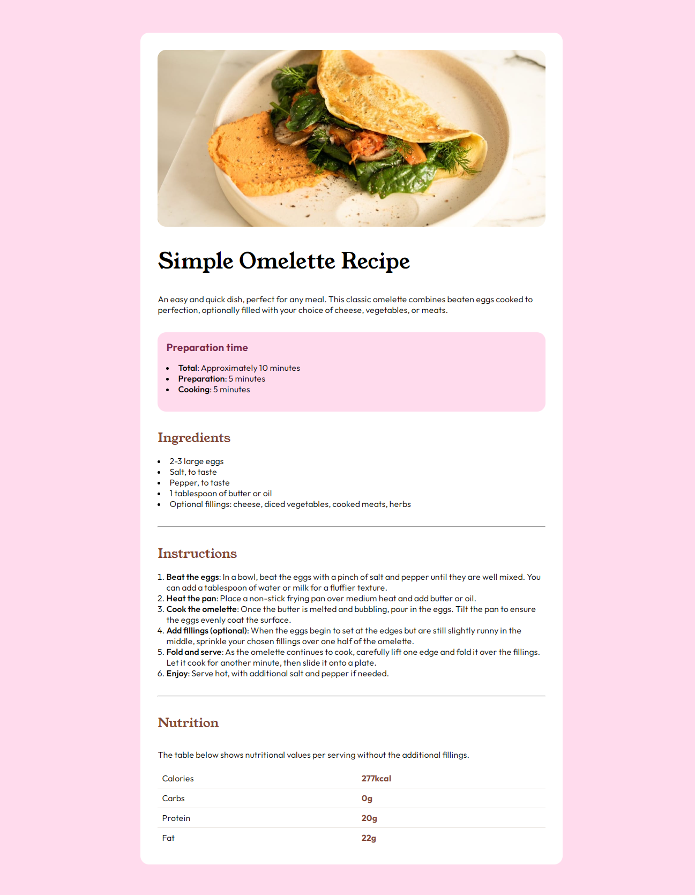

# Frontend Mentor - Recipe Page Solution

This is a solution to the [Recipe page challenge on Frontend Mentor](https://www.frontendmentor.io/challenges/recipe-page-KiTsR8QQKm). Frontend Mentor challenges help you improve your coding skills by building realistic projects.

## Table of contents

- [Overview](#overview)
  - [The challenge](#the-challenge)
  - [Screenshot](#screenshot)
  - [Links](#links)
- [My process](#my-process)
  - [Built with](#built-with)
  - [What I learned](#what-i-learned)
  - [Continued development](#continued-development)
- [Author](#author)

## Overview

### The challenge

The challenge is to build a recipe page and make it look as close to the design as possible. I can use any tools I want to complete the challenge.

### Screenshot

### Links

- Solution URL: [Recipe Page Main](https://github.com/NotMoreMika/recipe-page-main.git)
- Live Site URL: [Recipe Page Main](https://your-live-site-url.com)

## My process

### Built with

- Semantic HTML5 markup
- CSS custom properties

### What I learned

While working on this project, I improved my skills in:

- Responsive design with media queries.
- Responsive Images.
- Using Git/GitHub.

### Continued development
In future projects, I want to focus on:

Enhancing my understanding of accessibility in web applications.
Adopting best practices for writing cleaner, more maintainable, and scalable code.
Continuously refining my responsive design skills to provide a seamless experience across all devices and screen sizes.

## Author

- X - [Mika](https://www.x.com/notmore_mika)
- Frontend Mentor - [NotNoreMika](https://www.frontendmentor.io/profile/notmoremika)

